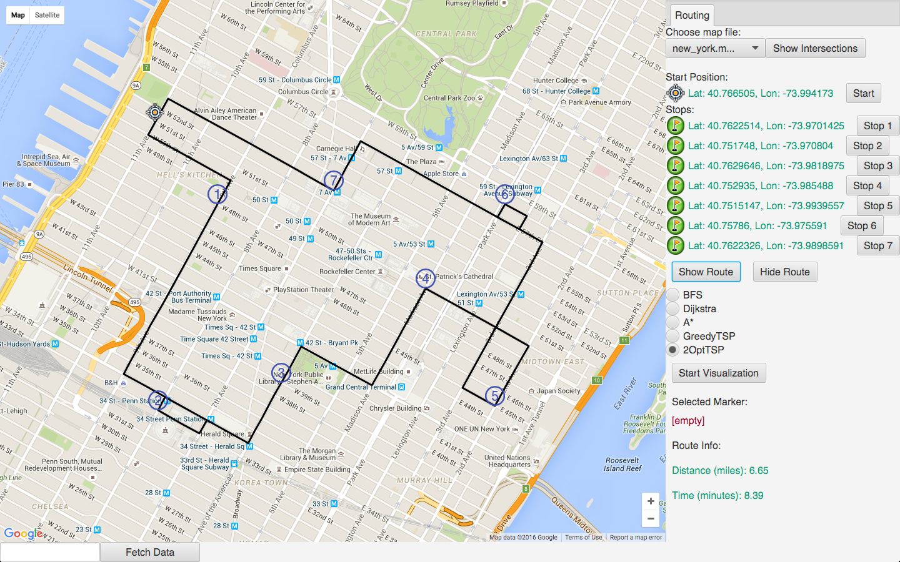
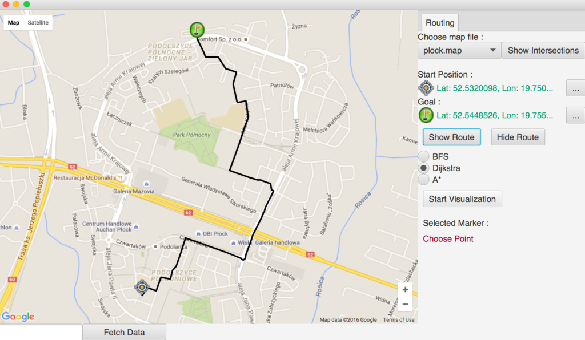

#  Advanced Data Structures in Java

[Course Link](https://www.coursera.org/learn/advanced-data-structures?specialization=java-object-oriented)

About this Course:
>How does Google Maps plan the best route for getting around town given current traffic conditions?  How does an internet router forward packets of network traffic to minimize delay?  How does an aid group allocate resources to its affiliated local partners?

To solve such problems, we first represent the key pieces of data in a complex data structure. In this course, you’ll learn about data structures, like graphs, that are fundamental for working with structured real world data.  You will develop, implement, and analyze algorithms for working with this data to solve real world problems.   In addition, as the programs you develop in this course become more complex, we’ll examine what makes for good code and class hierarchy design so that you can not only write correct code, but also share it with other people and maintain it in the future.

The backbone project in this course will be a route planning application.  You will apply the concepts from each Module directly to building an application that allows an autonomous agent (or a human driver!) to navigate its environment.  And as usual we have our different video series to help tie the content back to its importance in the real world and to provide tiered levels of support to meet your personal needs.

This course is provided by UCSD

## After completing this course, you will be able to...
1. Implement Graphs in Java from scratch.
2. Analyze the performance of different implementations of Graphs.
3. Work with Java's built-in classes for fundamental data structures including: HashSet, HashMap, and PriorityQueue.
4. Design classes to solve a high-level process, including fields, methods, and inheritance relationships.
5. Describe and implement several algorithms for graph search.
6. Evaluate the performance of different graph search algorithms in different contexts.
7. Use graphs and graph algorithms to plan routes using real data.

## Project Overview
Mapping applications such as Google Maps have changed the way millions of people live. For many people, the last time they had to "give someone directions" to their home or office was years ago! But how do these technologies work? At their heart is a data structure called a graph. Once you understand and can implement graphs and graph algorithms, you can implement a huge part of the core functionality of these sophisticated mapping applications!

The project for this course is to build a mapping application with the ability to provide and visualize routes from one point to another in a map. Each week you’ll add a bit more functionality to your mapping application through the project associated with that week, and in the last week of the course you'll have the opportunity to do an extension to your tool of your choosing.

The code you’ll be developing here is what’s called “back-end” code, in that you’ll be working with road data, but not directly with the front-end interface. Separating the back-end functionality from the front end interface is a very common software engineering practice, and in this class the ideas we're learning fit firmly into this back-end functionality. But just developing back-end code can be dry, so we provide you with a front end map interface that uses the Google Maps API. This interface may look like Google Maps, but it needs your code to work! By the end of the course, you'll have built something that really looks and feels like Google Maps! Admittedly, it will be quite primitive compared to the real Google Maps, but hey, you're just one person coding for one month (and part-time, at that). The real Google Maps took months or years to develop with a team of many professional engineers.

If you feel inspired, you’re always welcome to play with the front-end code as well. Although we will not explicitly cover it in this course, we encourage you to seek external resources and play around if you are interested.

### Part 1: Implement the degreeSequence method in the file Graph.java
Implement the degreeSequence method in the Graph class. Use the comments in the code and the description in the videos to understand what this method should do.

You will find the following two provided methods very helpful for this part:

getNeighbors(int v)-- returns a list containing the integer indices of vertices appearing as the end point of edges starting at v. Note: if there are multiple edges between v and one of its neighbors, then that neighbor appears multiple times in this list.
getInNeighbors(int v) -- similar to above except returning list of indices of vertices which are the start points of edges that end at v.
Note that these methods are implemented in Graph's subclasses, and can be called from the Graph class.

Test your implementation on fake data. Our main method in Graph.java provides a skeleton for testing the methods you wrote in this section. Use and add to this method to do thorough testing of your methods.

All edges in the above map are considered 2-way. That is, for each line in the map, there are actually two edges in the graph, one in each direction.

You can use this very simple map for testing, and you can also look at it to see how the map files are set up. You can make a copy of this file and modify it to modify the map you are testing with.

### Part 2: Implement the getDistance2 method in both GraphAdjList and GraphAdjMatrix implementations
Follow the method header comments to implement the method getDistance2 in both the GraphAdjList and GraphAdjMatrix classes.

Also, make sure you are consistent with our test cases/examples in the main method. In particular, if there are multiple two-hop paths to get to a vertex, then that vertex should be listed multiple times.

### Part 3: Design and Implement classes to represent a graph that stores street data and implement the breadth-first search (BFS) algorithm on this graph to generate driving directions in the graph.
Your goals in this assignment are to design and implement a set of classes that will represent the graph structure that stores the street data and to use these classes to implement the missing methods in MapGraph.

MapGraph is a directed graph that represents the road connections between intersections. Vertices in a MapGraph are GeographicPoints (latitude, longitude pairs) that correspond to intersections or dead ends between roads, while the edges are the road segments between these intersections. This graph is directed, so each pair of nodes on a two-way street will have two edges between them: one in each direction.

### Part 4: Extending and Improving Graph Search
In this project, you will augment your classes to support the execution of Dijkstra's algorithm to find the shortest path through a weighted graph and to support execution of the A Star Search algorithm which optimizes search for our project.

You will be working in the same code as you did last week, specifically you will be completing two methods in the MapGraph.java file in the roadmap package. You may need to revise (or add) other classes to your class organization from last week to support the execution of these methods.

As was the case last week, there are several other packages, but you don't need to worry too much about them. Except for GeographicPoint objects (in the geography package) and the MapLoader (in the util package) which you might use in main, you will not directly use any of the other classes in these packages.

### Learning Outcomes

1. Design classes to implement a graph in Java
2. Implement basic graph search algorithms including breadth first search, Dijkstra's Algorithm, and A* Search.
3. Work with real-world geographic road data
4. Review your peers' software design
