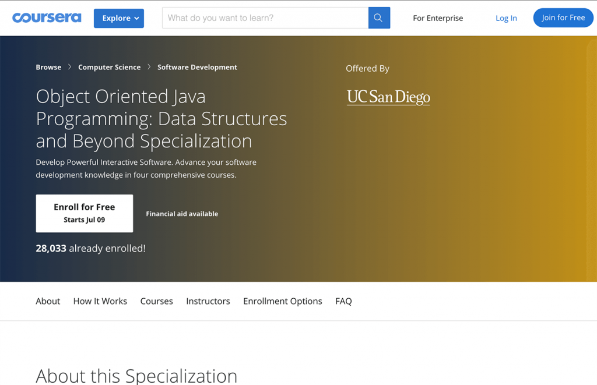

# Object Oriented Java Programming: Data Structures and Beyond Specialization

>This Specialization covers intermediate topics in software development. You’ll learn object-oriented programming principles that will allow you to use Java to its full potential, and you’ll implement data structures and algorithms for organizing large amounts of data in a way that is both efficient and easy to work with. You’ll also practice critically evaluating your own code, and you’ll build technical communication skills that will help you prepare for job interviews and collaborative work as a software engineer. In the final Capstone Project, you’ll apply your skills to analyze data collected from a real-world (social) network. Google has contributed real-world projects and the involvement of its engineers as guest lecturers to these courses. A small, select group of top learners who complete the Specialization will be offered practice interviews with Google recruiters. Invitation to a practice interview does not guarantee an actual interview or employment.

[Specialization Link](https://www.coursera.org/specializations/java-object-oriented)

This program is offered by :

## There are 5 Courses in this Specialization

1. [Object Oriented Programming in Java](https://github.com/athos2113/Object-Oriented-Programming-in-Java-Specialization/tree/master/3.%20Object%20Oriented%20Programming%20in%20Java)

>Welcome to our course on Object Oriented Programming in Java using data visualization. People come to this course with many different goals -- and we are really excited to work with all of you! Some of you want to be professional software developers, others want to improve your programming skills to implement that cool personal project that you’ve been thinking about, while others of you might not yet know why you’re here and are trying to figure out what this course is all about. This is an intermediate Java course. We recommend this course to learners who have previous experience in software development or a background in computer science. Our goal is that by the end of this course each and every one of you feels empowered to create a Java program that’s more advanced than any you have created in the past and that is personally interesting to you. In achieving this goal you will also learn the fundamentals of Object Oriented Programming, how to leverage the power of existing libraries, how to build graphical user interfaces, and how to use some core algorithms for searching and sorting data. And this course is project-based, so we’ll dive right into the project immediately! We are excited to be offering a unique course structure, designed to support learners of different backgrounds in succeeding at their own pace. The first module explains how this will work and if this course is right for you. We also recommend taking a few minutes to explore the course site. A good place to start is the navigation bar on the left. Click Course Content to see what material we’ll cover each week, as well preview the assignments you’ll need to complete to pass the course. Click Discussions to see forums where you can discuss the course material with fellow students taking the class. Be sure to introduce yourself to everyone in the Meet and Greet forum. This course should take about 6 weeks to complete. You can check out the recommended course schedule below to see a quick overview of the lessons and assignments you’ll complete each week. We’re excited you’re here learning with us. Let’s get started!

2. [Data Structures and Performance](https://github.com/athos2113/Object-Oriented-Programming-in-Java-Specialization/tree/master/4.%20Data%20Structures%20and%20Performance)

>How do Java programs deal with vast quantities of data? Many of the data structures and algorithms that work with introductory toy examples break when applications process real, large data sets. Efficiency is critical, but how do we achieve it, and how do we even measure it? This is an intermediate Java course. We recommend this course to learners who have previous experience in software development or a background in computer science, and in particular, we recommend that you have taken the first course in this specialization (which also requires some previous experience with Java). In this course, you will use and analyze data structures that are used in industry-level applications, such as linked lists, trees, and hashtables. You will explain how these data structures make programs more efficient and flexible. You will apply asymptotic Big-O analysis to describe the performance of algorithms and evaluate which strategy to use for efficient data retrieval, addition of new data, deletion of elements, and/or memory usage. The program you will build throughout this course allows its user to manage, manipulate and reason about large sets of textual data. This is an intermediate Java course, and we will build on your prior knowledge. This course is designed around the same video series as in our first course in this specialization, including explanations of core content, learner videos, student and engineer testimonials, and support videos -- to better allow you to choose your own path through the course!

3. [Advanced Data Structures in Java](https://github.com/athos2113/OOP-in-Java-Data-Structures-and-Beyond-Specialization/tree/master/3.%20Advanced%20Data%20Structures%20in%20Java)

>How does Google Maps plan the best route for getting around town given current traffic conditions? How does an internet router forward packets of network traffic to minimize delay? How does an aid group allocate resources to its affiliated local partners? To solve such problems, we first represent the key pieces of data in a complex data structure. In this course, you’ll learn about data structures, like graphs, that are fundamental for working with structured real world data. You will develop, implement, and analyze algorithms for working with this data to solve real world problems. In addition, as the programs you develop in this course become more complex, we’ll examine what makes for good code and class hierarchy design so that you can not only write correct code, but also share it with other people and maintain it in the future. The backbone project in this course will be a route planning application. You will apply the concepts from each Module directly to building an application that allows an autonomous agent (or a human driver!) to navigate its environment. And as usual we have our different video series to help tie the content back to its importance in the real world and to provide tiered levels of support to meet your personal needs.

4. [Mastering the Software Engineering Interview]()

>You’ve hit a major milestone as a computer scientist and are becoming a capable programmer. You now know how to solve problems, write algorithms, and analyze solutions; and you have a wealth of tools (like data structures) at your disposal. You may now be ready for an internship or (possibly) an entry-level software engineering job. But can you land the internship/job? It depends in part on how well you can solve new technical problems and communicate during interviews. How can you get better at this? Practice! With the support of Google’s recruiting and engineering teams we’ve provided tips, examples, and practice opportunities in this course that may help you with a number of tech companies. We’ll assist you to organize into teams to practice. Lastly, we’ll give you basic job search advice, and tips for succeeding once you’re on the job.

5. [Capstone: Analyzing (Social) Network Data]()

>In this capstone project we’ll combine all of the skills from all four specialization courses to do something really fun: analyze social networks! The opportunities for learning are practically endless in a social network. Who are the “influential” members of the network? What are the sub-communities in the network? Who is connected to whom, and by how many links? These are just some of the questions you can explore in this project. We will provide you with a real-world data set and some infrastructure for getting started, as well as some warm up tasks and basic project requirements, but then it’ll be up to you where you want to take the project. If you’re running short on ideas, we’ll have several suggested directions that can help get your creativity and imagination going. Finally, to integrate the skills you acquired in course 4 (and to show off your project!) you will be asked to create a video showcase of your final product.
